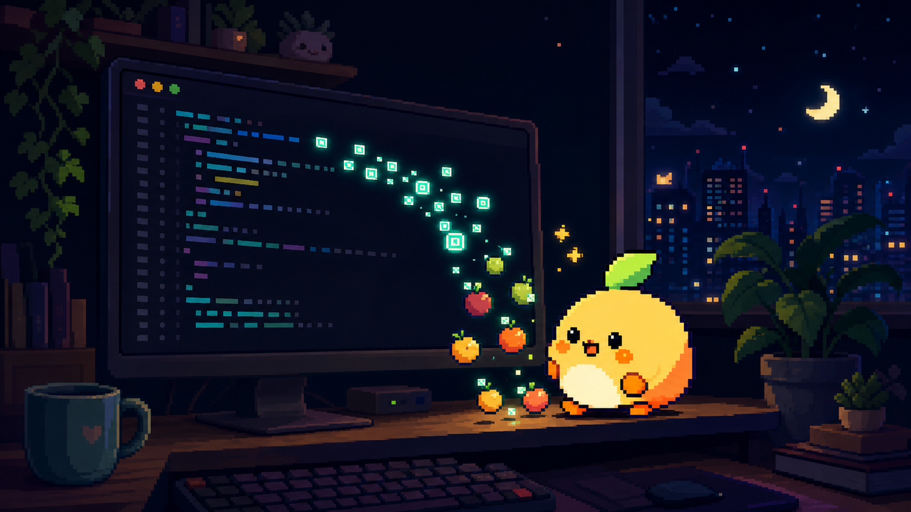

# Tokengochi



A desktop pet that lives on your screen and grows on the tokens you burn using AI coding tools. Feed it Claude Code usage, watch it wander, eat, evolve, and hoard your ambient token spend as a Tamagotchi-style companion.

[](https://github.com/dodoxtech/tokengochi/releases/latest)
[](LICENSE)
[](https://ko-fi.com/dodoxtech)

See [docs/product.md](docs/product.md) for the full pitch and [docs/architecture.md](docs/architecture.md) for how it's built.

## Why

Developers already burn tokens all day using AI coding tools. Tokengochi turns that invisible metric into an ambient, emotional companion instead of a source of anxiety — no accounts, no server, no analytics dashboard, just a pixel-art pet that grows on your real usage.

## Features

- 🐾 Transparent, always-on-top desktop pet that wanders your screen edges and taskbar
- 🍜 Real AI token usage (starting with Claude Code) converts into food, XP, and evolution
- 📦 Local-first: state lives in SQLite on your machine, no network calls required for the core loop
- 🖥️ Cross-platform: macOS, Windows, and Linux (X11 first, Wayland best-effort)
- 🧩 Extensible provider model for other LLM CLIs/tools

## Installing

Download the installer for your OS from the [latest release](https://github.com/dodoxtech/tokengochi/releases/latest).

| OS | File |
| --- | --- |
| macOS (Apple Silicon) | `Tokengochi_x.y.z_aarch64.dmg` |
| macOS (Intel) | `Tokengochi_x.y.z_x64.dmg` |
| Windows | `Tokengochi_x.y.z_x64-setup.exe` |
| Linux (Debian/Ubuntu) | `tokengochi_x.y.z_amd64.deb` |
| Linux (other distros) | `tokengochi_x.y.z_amd64.AppImage` |

> **These builds are unsigned for the MVP release** (see [ADR-0004](docs/decisions/0004-unsigned-mvp-release.md)). Your OS will warn you before first launch — this is expected:
>
> - **macOS:** Gatekeeper blocks the app ("cannot be opened because the developer cannot be verified"). Right-click the app → **Open** → **Open** again in the dialog. If that doesn't work, run `xattr -dr com.apple.quarantine /Applications/Tokengochi.app` in Terminal.
> - **Windows:** SmartScreen shows "Windows protected your PC". Click **More info** → **Run anyway**.
> - **Linux:** no OS-level warning; mark the AppImage executable (`chmod +x`) before running it.

Once installed, Tokengochi launches into onboarding: pick a starter egg, and it auto-detects Claude Code usage if present. The app lives in your system tray — closing the dashboard window hides it, quit from the tray menu.

## Updating

Tokengochi checks GitHub Releases for new versions. Open the dashboard → **Settings** → **Check for updates**. Update downloads and installs are cryptographically verified independent of OS code signing; your pet's state (level, streak, inventory) is stored locally and survives updates.

## Development

```sh
npm ci --prefix ui/dashboard
npm ci --prefix ui/overlay
cargo tauri dev   # run from src-tauri/
```

See [docs/README.md](docs/README.md) for the full documentation map, and [docs/knowledge/release-process.md](docs/knowledge/release-process.md) for how to cut a tagged release.

## Contributing

Contributions are welcome. Before opening a PR:

1. Read [docs/README.md](docs/README.md) and the relevant docs under `docs/` for product and architecture context.
2. Check [docs/tasks/active/](docs/tasks/active/) and [docs/tasks/backlog/](docs/tasks/backlog/) for existing work before starting something new.
3. Open an issue or pick up a backlog task to discuss the change before investing significant time.

## Support

Tokengochi is free and open source. If it made your terminal a little less lonely, you can support development on [Ko-fi](https://ko-fi.com/dodoxtech).

## License

[MIT](LICENSE)
